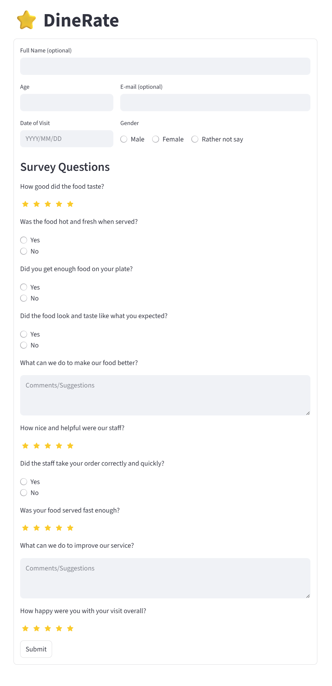

# ⭐ DineRate

DineRate is a simple and interactive survey application built with Streamlit and SQLAlchemy. It allows users to submit feedback about their dining experience, which is stored in a local SQLite database for analysis and review. The survey questions are fully customizable and extendable through a templated JSON file, allowing you to define both the question text and response type.



> This screenshot shows the main survey form where users enter their details and respond to questions.

## Features

- Streamlit-powered web interface for collecting survey responses
- Customizable and Extendable survey questions loaded from a JSON file
- Input validation and user-friendly feedback
- SQLite database integration via SQLAlchemy ORM
- Stores demographic info and question-level responses

## Installation

1. **Install dependencies**

   ```bash
   pip install -r requirements.txt
   ```

2. **Run the app**

   Navigate to the project folder and launch:

   ```bash
   streamlit run app.py
   ```

   The app will launch in your browser. Fill out the form and submit your feedback—responses will be saved to `instance/dinerate.db`.

## Database

The `survey_responses` table stores each response with the following fields:

| Column        | Type    | Description                 |
| ------------- | ------- | --------------------------- |
| id            | Integer | Primary key                 |
| full_name     | String  | Optional name of respondent |
| age           | Integer | Age of respondent           |
| gender        | String  | Gender of respondent        |
| email         | String  | Optional email              |
| date_of_visit | Date    | Date of restaurant visit    |
| qid           | String  | Question ID                 |
| question      | Text    | Question text               |
| answer        | Text    | User's answer               |

## Validation Rules

- Age must be numeric
- Date and gender are required
- All survey questions must be answered
